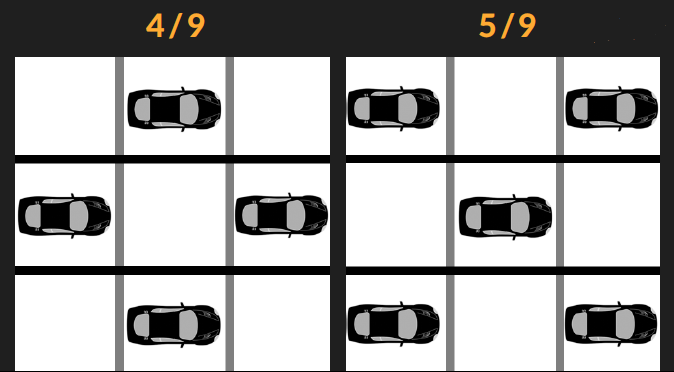
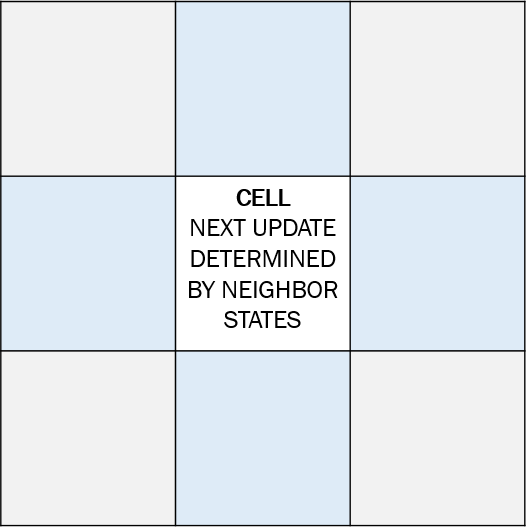
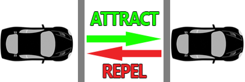
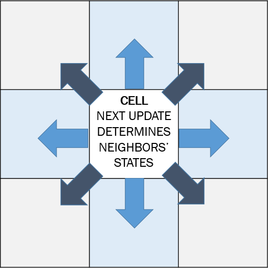
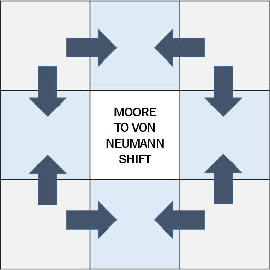

## ADama Model

Dama means checkerboard in Turkish. The hypothetical optimal car formation in a 3x3 grid is a checkerboard, allowing a car to move forward and merge sideways without any disruption to the flow. 



ADama is a nod to one of my favorite shows, [Battlestar Galactica](https://www.youtube.com/watch?v=evodPpqb9H4). 

A cellular automaton (CA) is a search function around a cell. The conventional update rule is based on the cell values in a cell's neighborhood.



There is an inherent attraction and repulsion between two cars in a lane. The tailing car is aiming to move forward into the front car's current position in the next time frame. However, the car in the back needs to leave a trailing distance to avoid crashing into the front. This is akin to a repulsion force.



I hypothesize this attraction-repulsion between two cars in a lane is a **long-range dipole interaction** in the driving direction. In the normal direction of driving, with the lane merging the **dipole vanishes**.

In order to simulate the act of driving in a CA, I had to inverse the update rule to initiate the motion from a cell, as it is the case with a car. A driver decides the destination.



You can use the [editor on GitHub](https://github.com/goktu/ADama/edit/gh-pages/index.md) to maintain and preview the content for your website in Markdown files.

### Driving Dipole Code Block

```markdown
elif c[x,y] == 1:
    array1.append(c[x, y])
    for z in range(-1, 2):
        # block generation from randomly distributed points
        
        # neighbor updating from cell(x, y)
        n = number_of_upper_neigbors(x, y)
        if n == 1:
            nc[x, (y + 1) % L] = 1  
```
Above code block only shows the driving motion for a cell's upper neighbors. The same is repeated for right and below neighbors, and for the left neighbor the only difference is the left neighboring cell's value being updated to zero, to simulate the departure from a car's position. 

The search function is run over a Moore neighborhood, but the updated value corresponds to the von Neumann neighbor of a cell. Both neighborhoods are shown above. This is to collect a Moore neighborhood into a von Neumann one. It is hypothesized that this Moore-to-von Neumann shift is a renormalization by decimation and the NERCCS 2021 poster presentation explores a mathematical verification for this claim.

<a href="pdf/GoktugIslamoglu_NERCCS2021_Presentation.pdf" class="image fit" type="application/pdf"></a>

```markdown
Syntax highlighted code block

# Header 1
## Header 2
### Header 3

- Bulleted
- List

1. Numbered
2. List

**Bold** and _Italic_ and `Code` text

[Link](url) and 
```

For more details see [GitHub Flavored Markdown](https://guides.github.com/features/mastering-markdown/).

