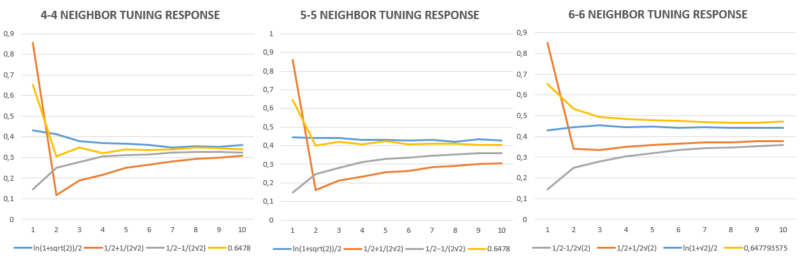

## ADama Model

Dama means checkerboard in Turkish. The hypothetical optimal car formation in a 3x3 grid is a checkerboard, allowing a car to move forward and merge sideways without any disruption to the flow. 


ADama is a nod to one of my favorite shows, [Battlestar Galactica](https://www.youtube.com/watch?v=evodPpqb9H4). 

A cellular automaton (CA) is a search function around a cell. The conventional update rule is based on the cell states in a cell's neighborhood.


There is an inherent attraction and repulsion between two cars in a lane. The tailing car is aiming to move forward into the front car's current position in the next time frame. However, the car in the back needs to leave a trailing distance to avoid crashing into the front. This is akin to a repulsion force.


I hypothesize this attraction-repulsion between two cars in a lane is a **long-range dipole interaction** in the driving direction. In the normal direction of driving, with the lane merging the **dipole vanishes**.

In order to simulate the act of driving in a CA, I had to inverse the update rule to initiate the motion from a cell, as it is the case with a car. A driver decides the destination.


### Driving Dipole Code Block

```markdown
elif c[x,y] == 1:
    array1.append(c[x, y])
    for z in range(-1, 2):
        # block generation from randomly distributed points
        
        # neighbor updating from cell(x, y)
        m = number_of_upper_neigbors(x, y)
        if m == 1:
            nc[x, (y + 1) % L] = 1  
```


The search function is run over a Moore neighborhood, but the updated state corresponds to the von Neumann neighbor of a cell. Both neighborhoods are shown above. This is to collect a Moore neighborhood into a von Neumann one. It is hypothesized that this Moore-to-von Neumann shift is a renormalization by decimation and the NERCCS 2021 poster presentation explores a mathematical verification for this claim (clink on the image below to view the presentation).

<a href="pdf/GoktugIslamoglu_NERCCS2021_Presentation.pdf" class="image fit" type="application/pdf"></a>

Above code block only shows the driving motion for a cell's upper neighbors, if a cell's state is 1. The same is repeated for below neighbors. For right and left neighbors, the only difference is the adjustment based on the occupancy of upper and lower neighborhoods. Right neighboring cell's state is updated to one, while the left neighboring cell's state is updated to zero, to simulate the departure from a car's position. 

### Moore to von Neumann Shift

```markdown
# neighbor updating from cell(x, y)
m = number_of_upper_neigbors(x, y)
if m == 1:
    nc[x, (y + 1) % L] = 1  
        
n = number_of_lower_neigbors(x, y)
if n == 1:
    nc[x, (y - 1) % L] = 1    
        
k = number_of_right_neigbors(x, y)
if k == 0 and (m <= 1 or n <= 1):
    nc[(x + 1) % L , (y + z) % L] = 1
        
l = number_of_left_neigbors(x, y)
if l == 0 and (m > 1 or n > 1):
    nc[(x - 1) % L , (y + z) % L] = 0     
```
Next step is tuning the neighborhood for an optimal configuration. To achieve this, limits to Moore and von Neumann neighborhood occupancies are added.


### Moore and von Neumann Tuning

```markdown
g = number_of_Moore_neigbors(x, y) #CA tuning
if c[x, y] == 0:
    nc[x, y] = 0 if g <= 6 else 1
    array0.append(c[x, y])
    
h = number_of_Neumann_neigbors(x, y) #CA tuning
if h >= 1:
    nc[x, y] = 1 if g <= 6 else 0
``` 
While for 4-4 and 5-5 tuning, the maximum total count of cells with state 1 in the grid is the inverse Ising critical temperature. For 6-6 tuning, however, the maximum count corresponds to a higher value. The exact value is investigated in the presentation.



The last part of the rule is coupling the cells to their neighborhoods. This is necessary for simulating driving as a car's speed must be maintained relatively to the cars' speed in their front and on the adjacent lanes.  

### Coupling Function

```markdown
if g / 8 > (1 - p) * p: # coupling function
    nc[(x + 1) % L, y] = 1
elif g / 8 < (1 - p) * p:
    nc[(x - 1) % L, y] = 1    
else:
    nc[x, y] = 1
```

_Cellular automata coupling function obtained from the paper below:_

[Synchronization of stochastically coupled cellular automata](https://journals.aps.org/pre/abstract/10.1103/PhysRevE.58.R8)


The roots of this coupling equation are the first-order phase transition points.
